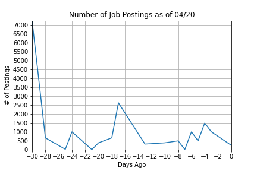
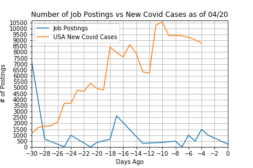
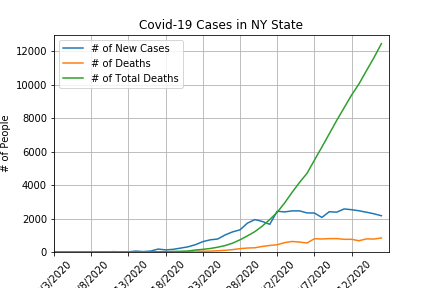
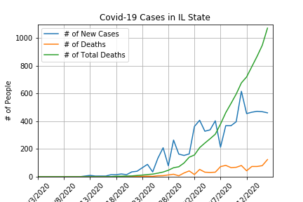
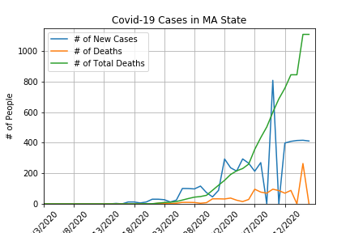
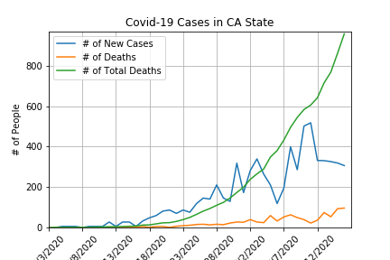
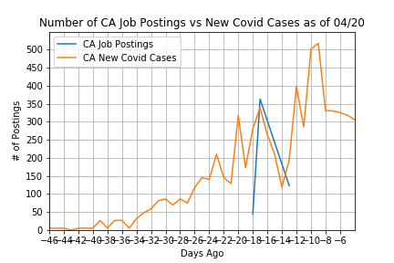
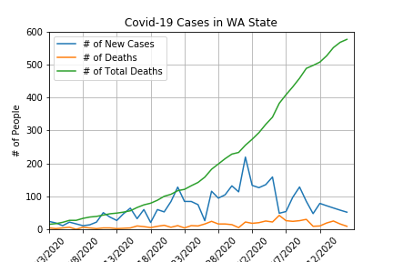

# US Job Market Tests Positive for COVID-19

**Team:** Karl Ramsay (Project Manager), Oswaldo Moreno (Data Engineer), Swati Dontamsetti (Data Engineer), Amber Martin (Data Analyst), Firzana Razak (Data Analyst), Anthony Brown (Data Analyst)

## Overview
The United States has cut nearly 10 million jobs in recent weeks due to the COVID-19 shutdown. In one weeks time, this project will provide an analysis of the impact the COVID-19 shutdown has had on the Data Science job market.

*Hypothesis: As new cases of COVID-19 crop up, the number of job postings will decline.*

We decided to use <a href="https://www.indeed.com/">Indeed</a> for our job postings search, and we compared the results with the data from the <a href="https://covid19.healthdata.org/united-states-of-america">Institute for Health Metrics and Evaluation</a> on COVID-19 cases, to see if our hypothesis is true, and to what degree.

We have the data shown for all of the United States, but we also broke the data down by "Top Cities" for Data Science jobs as provided by <a href="https://datajobs.com/">DataJobs</a>: New York, Chicago, Boston, San Francisco (Bay Area), and Seattle.

### Some Considerations
Indeed on provides how many dags ago a job was posted as it's timestamp on a posting, and it only goes back so far as 30 days. So any jobs posted before 29 days ago shows up as 30+. This means that 30 days ago in our graphs means 30+ days ago.

However, since, most states issued lockdowns around <a href="https://en.wikipedia.org/wiki/2020_coronavirus_pandemic_in_the_United_States">March 19th</a>, which is 32 days ago from the day we collected our data from Indeed (April 20th), this timed out perfectly for our analysis.

This data is all very new and current, so there is no way of creating a longitudinal study. And as both job-postings are limited in their window of staying on websites, and there is no real test-case to compare this too, there is no way to see how our current results compare to other pandemics of the past.
   
The analysis was done using the ETL model.

## Extract
We used `Beautiful Soup` in `Jupyter Notebook` to scrape data from Indeed. We scraped indeed 5 different times for each of our 5 "Top Cities:" New York, Chicago, Boston, San Francisco (Bay Area), and Seattle. The data we were looking for was the job title, company, location, salary, and date posted from each job posting.

However, because Indeed provides results based on a radius, it gave us results from other cities and neighboring states as well. All the data collected was gathered into one dataframe, which was saved as a CSV.

Our second data source was from the IHME's website. The data was already provided to us as CSV.

## Transform
### Indeed Data
The Indeed Data was cleaned in `Jupyter Notebook` using `Python` and the `pandas` library. The process was many fold.
1. We had to take out "\n" and replace it was a space every where it appeared.
2. The day posted column came as a phrase like "18 days ago", but we only wanted the number. So we split the column into many columns using the space. And afterwards, we had to split it by "+" to take it out of the "30+ days ago." And then all the columns, except the one with number, were dropped.  
  2a. We were then left with the phrase "Today" and "Just", which was part of "Just Now", which had to be replaced with the number 0.  
  2b. The posted date had to be made negative for when we created our graphs, since the day posted was the number of days AGO from the day the data was gathered. 
3. We then dropped all results where there was no job title present.
4. As a CSV, the datetime was made into an object, so we had to transform it back into a datetime so that it could used later for math that was done in the COVID-19 Data.

### COVID-19 Data
The data from IHME was comprehensive, and provided results from numerous states and many different countries. It also provided more hospital data (like number of ventilators needed and ICU beds used) than we need. The data was first cleaned manually in `Excel` and then in `Jupyter Notebook`.
1. All rows that were the new deaths, new COVID-19 cases, and total deaths were deleted.
2. All columns that weren't the states of our Top Cities, and over all Country results (USA, New York, Illinois, Massachusetts, California, and Washington) were deleted.
* This was then saved as a CSV to be read in `Jupyter Notebook`
3. The data column needed to be transformed into datetime, so that, the date in the COVID-19 Data could be subtracted for the date the data was gathered in the Indeed Data to create a column that showed how many days ago the results were taken.  
3a. This new column was added to the original COVID-19 data.
4. The data was first seperated into 6 new data frames - one for each state/country - so that data could be plotted over time using the `matplotlib.pyplot` and `numpy` libraries.

## Load

We used the micro-framework `Flask` inside of `Python` to create our website that would showcase our data. Both `HTML` and the `Bootstrap` library were used to beautify our website.

The final data was stored in a `Mongo` database, which was used to print our Indeed results. We chose to limit the number of results chosen to 300, because the 18,000 results we had saved would take too long to load on our page.

## Final Results & Analysis
*Consideration: Even though we placed job postings and COVID-19 cases on top of each other we should consider prior COVID-19 spikes and dips as affecting future job postings. So, the dip in COVID-19 cases 19 days ago in CA might account for the spike in job postings 17 days ago, and the subsequent spike in COVID-19 cases 17 days ago might account for the dip in job postings 13 days ago.*

In general, our hypothesis is correct: as new cases of COVID-19 cropped up, the number of job postings have declined. The degree to which this is true varies from State to State, as seen below.

### United States of America
 

 **Analysis:** The first COVID-19 cases in the US began 59 days ago on February 21st. From the graphs provided, it is clear, that as new cases of COVID-19 goes up the job postings are, overall, going down.

### New York
 
 **Analysis:** New York's first cases of COVID-19 started 42 days ago on March 9th. It is clear that as the situation in NY gets worse the job oppurtunities decline.

### Illinois

 **Analysis:** No job postings data from Illinois or nearby states, which would suggest that Chicago is not as popular a city for Data Scientists as <a href="https://datajobs.com/">DataJobs</a> says.

### Massachusetts

 **Analysis:** No job postings data from Massachusetts after 30 days ago, however, their first case of Covid started 36 days ago (March 15th). It's possible that the radius of Boston was too close to NYC and so there was overlap with those results. We can see results for states in CT, NJ, and PA which are near both Massachusetts and New York so it would be hard to say which results are meant for our Boston search.

### California
 
 **Analysis:** California's first cases of Covid started 46 days ago (March 5th). There is not many job postings provided for California, specifically the San Francisco Bay Area. This might suggest that San Francisco isn't as popular a city for Data Scientists. Or perhaps, since, California is renound for their start-ups, they might be posting their jobs on other sites than Indeed, like AngelList.

### Washington

 **Analysis:** No job postings data from Washington after 30 days ago, which could be because Washington's first cases of COVID-19 started 59 days ago (February 21st), so they would have slowed with the job postings much earlier.
